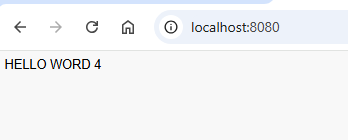
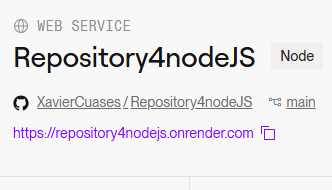
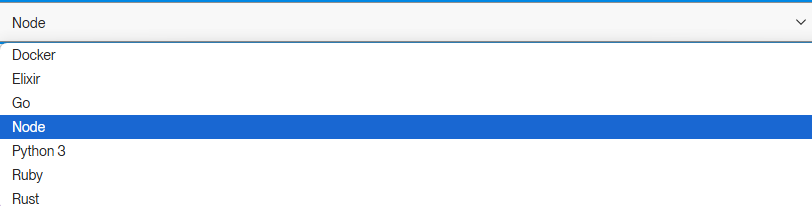
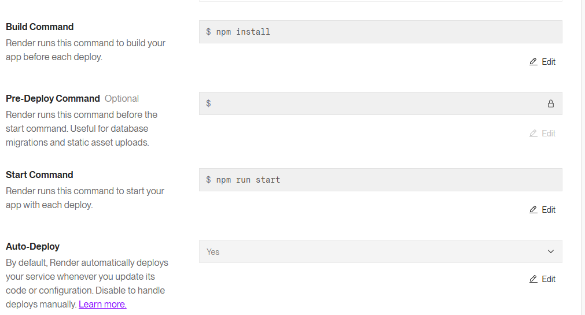

# Hello world whit in NodeJS
## Results
<p align="center">
   
</p>

In this "Hello World" program written in Node.js, a basic web server is started that listens for HTTP requests on port 8080. When a user navigates to http://localhost:8080, the server responds by sending an HTML page that includes a block of JavaScript code. This JavaScript code manipulates the page's DOM to dynamically display the "Hello World" message. While Node.js takes care of server configuration and handling HTTP requests, JavaScript executed in the browser takes care of updating the page content in real time without the need to reload the page or make new requests to the server.

## :open_book: How to use
* Clone the repository

    ```
    git clone https://github.com/XavierCuases/Repository4nodeJS.git
    ```
> [!NOTE]
This project is a foundational Node.js application designed to introduce key concepts in web development and deployment. The core file, app.js, initiates a server that listens on port 8080, delivering a simple "Hello World" message when accessed through a web browser at http://localhost:8080. Essential files such as package.json manage project dependencies, while an optional Dockerfile facilitates containerization, making the application portable across various environments.
By leveraging Node.js, npm, and potentially Docker, this project offers a practical hands-on experience. It covers fundamental aspects of web server creation, dependency management, and deployment strategies.

## :rocket: How to run in docker
### Pre-requisites
* Docker - DockerDesktop installed
* DockerHub account

### link image docker hub 

### Download image

[ImagenNodeJS](https://hub.docker.com/r/xaviercuases/ejercicio4nodejs "click for visit")

The link will be for the image to be able to download it
```
docker pull xaviercuases/ejercicio4nodejs
```
> [!IMPORTANT]
> NodeJS, by default, runs on port 8080 when using its built-in development server. This is intended for local development and testing purposes. If you need to change the port, Flask allows you to specify a different one when running the application.
### Run image
```
docker run --name <NEWCONTAINERNAME> -d -p 8080:8080 <IMAGENAME>
```
> [!TIP]
> The name of the downloaded image must match the one placed in the previous command, for this you can verify it using the **docker images** command. Additionally, you must check that there is no other container with the same name as the one placed in the command.
### View the results
Open new window browser and search localhost:8080

[View results](#results)

## :light_rail: PAAS Deploy with docker (render)
For its deployment in a PAAS we will rely on Render and its easy implementation thanks to its container management. 



This project is deployed on Render, which supports multiple programming languages:

Docker
Elixir
Go
Node.js
Python 3 (used in this project)
Ruby
Rust
This project uses Node.js to run a web application on Render. Simply select "Node.Js" during deployment, connect your repository, and follow Render’s setup instructions.



> [!IMPORTANT]
> Next, This project is configured to deploy on Render with the following settings:

In this setup, the Build Command is set to npm install, which installs all the necessary Node.js dependencies listed in the package.json file each time a new deployment is made. The Pre-Deploy Command is left empty, meaning no specific tasks (like database migrations) are required before starting the app. The Start Command is set to npm run start, which initiates the application with the start script defined in package.json. Auto-Deploy is enabled, so any updates to the code will trigger an automatic deployment without manual intervention.




## Link service PASS

[Hello World](https://repository4nodejs.onrender.com "click for visit")
